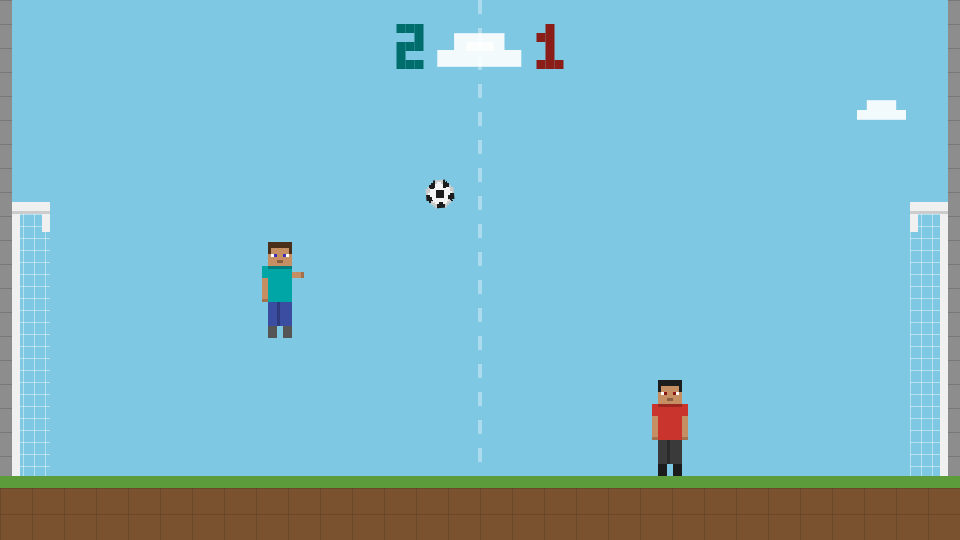
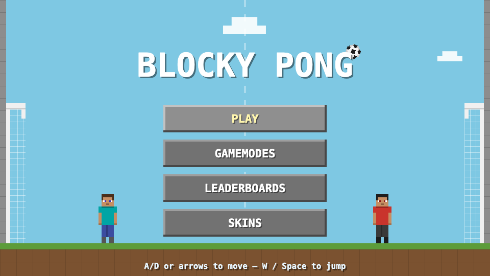

# Pixel Pitch ⚽

A Minecraft-styled soccer-pong game for the browser. Two blocky characters, one bouncy ball, two goals — first to **3 points** wins the match.

**▶ Play it now: https://finnmcf1.github.io/pixel-pitch/**

*(The online version runs without the leaderboard server — the leaderboard screen shows as offline there.)*



## How to play

| Action | Keys |
|---|---|
| Move | `A` / `D` or `←` / `→` |
| Jump | `W`, `Space`, or `↑` |
| Menus | Mouse, or `↑` / `↓` + `Enter` |
| Quit to menu | `Esc` |

The ball bounces freely off the floor, ceiling, characters, and crossbars. Score by getting it past your opponent into the goal mouth behind them — shots above the goal bounce back into play. Where the ball strikes your character shapes the shot, and moving or jumping into it adds power.

## Features

- **Vs. AI** with tunable difficulty (see the constants at the top of `game.js`)
- **Soccer goals** with solid crossbars — near-misses can rattle out
- **Skins** — 8 blocky character palettes that unlock as you win matches
- **Leaderboard** — real client/server setup backed by a local REST API
- **All art drawn in code** — pixel sprites are generated on canvas at runtime, no image assets
- Confetti, WebAudio sound effects, and an 8-bit victory fanfare



## Running it

Requires Python 3 (standard library only — no installs):

```sh
python3 server.py
```

Then open **http://127.0.0.1:8642**.

`server.py` serves the game files *and* hosts the leaderboard API:

| Endpoint | Purpose |
|---|---|
| `GET /api/leaderboard` | Top players, sorted by wins |
| `POST /api/result` | Record a finished match |

Leaderboard data persists in `leaderboard.json` (git-ignored). The game also works by opening `index.html` directly — everything runs client-side except the leaderboard.

## Project structure

```
index.html    page shell + canvas
style.css     fullscreen scaling, pixel rendering
game.js       the whole game: sprites, physics, AI, menus, skins, API client
server.py     static file server + leaderboard REST API (stdlib only)
sounds/       goal sound sample
docs/         screenshots
```

Player progress (skins, stats, name) lives in the browser's `localStorage` under `pixelPitch.*` keys.

## Roadmap

- **Gamemodes** — the menu button is there; modes are coming soon
- **Cloud leaderboard** — `server.py` is written to be deployable to any host when it's time to go global

## License

Code © Finn. The goal sound effect (`sounds/goal.mp3`) is an [Epidemic Sound](https://www.epidemicsound.com/) sample used under license — it is **not** covered by any open-source license and should not be reused outside this project.
